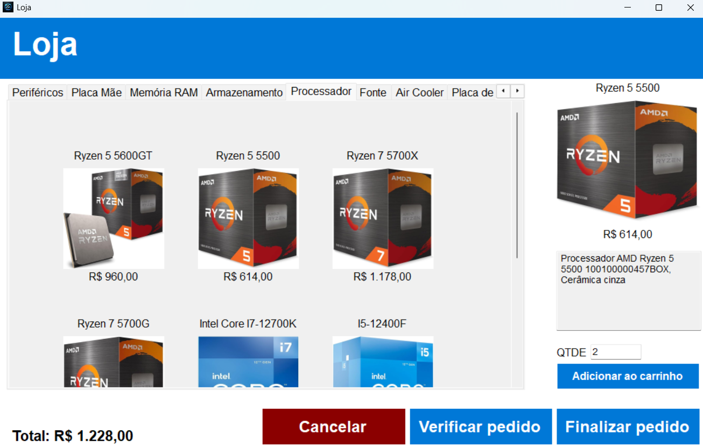

# HardwareStore - Sistema de Gestão de Loja de Informática

## Sobre o projeto
HardwareStore é um sistema de gerenciamento para lojas de informática, permitindo o controle de categorias de produtos, produtos e contas de funcionários. O sistema facilita a administração do estoque e das vendas, tornando a gestão mais eficiente.

Este projeto foi desenvolvido com o objetivo de praticar Windows Forms e C#, além de explorar o uso do banco de dados SQLite.



## Funcionalidades

- **Gerenciamento de Categorias** – Permite a criação, edição e exclusão de categorias de produtos.

- **Gerenciamento de Produtos** – Controle de produtos cadastrados, incluindo nome, descrição, preço e categoria.

- **Controle de Estoque** – Atualização automática da quantidade de produtos disponíveis conforme novas vendas são registradas.

- **Gerenciamento de Contas de Funcionários** – Cadastro, edição e remoção de contas de funcionários com diferentes níveis de acesso.  

- **Simulação de Venda** – Registro de vendas, calculando valores e atualizando o estoque automaticamente.  

- **Senhas Armazenadas com Hash** – Todas as senhas são criptografadas antes de serem salvas no banco de dados, garantindo maior segurança.

- **Recuperação de Senha** – Para redefinir a senha, é necessário um e-mail válido e acessível pelo usuário, garantindo autenticidade no processo.

## Tecnologias utilizadas


## Pré requisito

Ter instalado na máquina o **Visual Studio 2022**. Você pode baixá-lo <a href="https://visualstudio.microsoft.com/pt-br/vs/community/">aqui</a>.

## Observação

Dentro do projeto, apenas contas de **Administrador (ADM)** podem criar novas contas de funcionários. Além disso, todas as senhas são armazenadas no banco de dados em formato hash para garantir maior segurança.  


Para acessar o sistema pela primeira vez, utilize as seguintes credenciais:

**CPF**: 16315754278

**Senha**: Admin

Com essa conta, é possível criar outras contas a vontade!

## Como rodar localmente

1. Clone o repositório
    ```bash
    git clone git@github.com:CostaDenis/Hardware-Store.git
    ```

2. Abra o projeto:

- Navegue até a pasta do projeto.

- Clique duas vezes no arquivo "**Hardware Store.sln**".

- Aguarde o carregamento no Visual Studio 2022.

